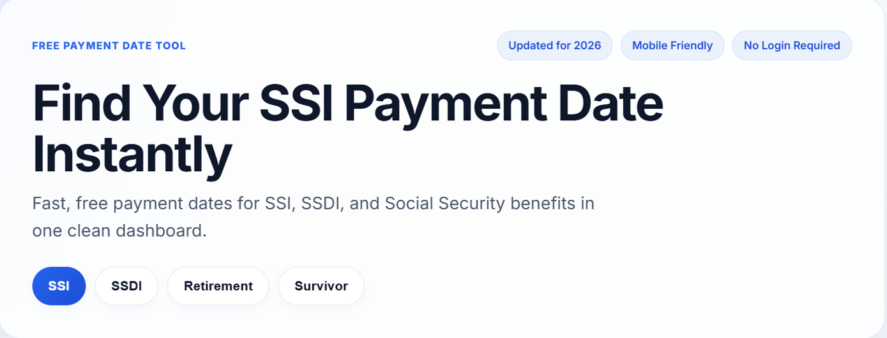
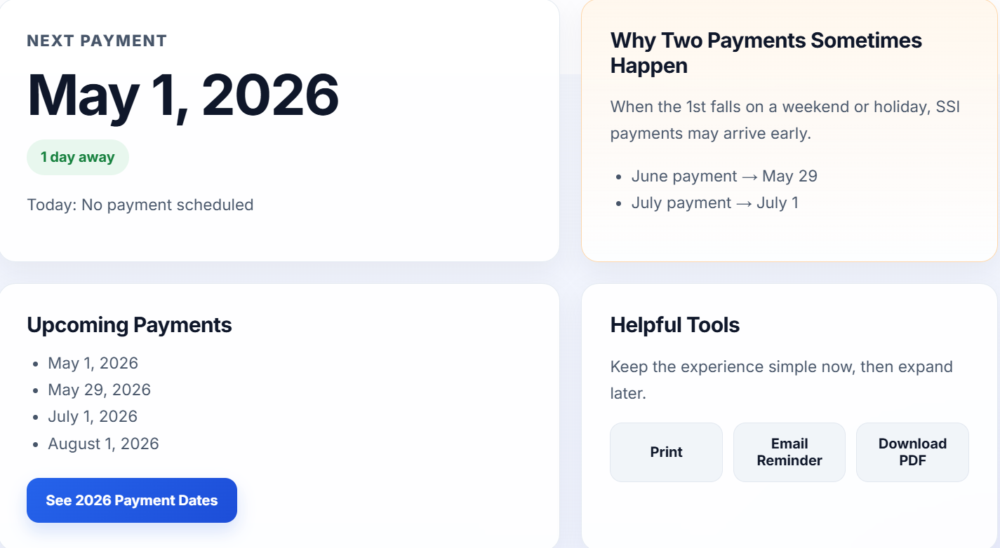

# MySSICalendar

Live Site: https://twillsmethod.github.io/myssicalendar/

---

## Preview
## Project Summary

MySSICalendar is a lightweight web application designed to simplify how users access Social Security payment schedules.

Instead of navigating complex government tables or PDFs, this tool provides a clean, interactive interface that instantly displays upcoming payment dates and dynamically calculates how far away the next payment is.

The project focuses on:
- Translating static government data into a user-friendly experience
- Implementing real-time date calculations using JavaScript
- Creating a responsive, accessible UI for everyday users

This project demonstrates my ability to take a real-world problem, structure the logic behind it, and deliver a practical, usable solution.

## Key Logic Highlight

- Dynamic “days away” calculation based on today's date
- Conditional handling for early payments when the 1st falls on weekends/holidays
- Tab-based UI state switching for multiple benefit types

---

## Overview

MySSICalendar is a simple, fast web tool that helps users instantly check upcoming SSI, SSDI, and Social Security payment dates.

It removes confusion around payment timing and presents key information in a clean, easy-to-use dashboard.

---

## Features

- View next payment date instantly
- Dynamic “days away” calculation
- Switch between SSI, SSDI, Retirement, and Survivor benefits
- Full 2026 calendar view
- Mobile-friendly design
- Print and utility tools

---

## Why I Built This

Many people rely on Social Security payments but struggle to find clear, easy-to-understand payment schedules.

This tool simplifies that process into a single, accessible interface.

---

## Tech Stack

- HTML
- CSS
- JavaScript
- GitHub Pages

---

## Live Demo

https://twillsmethod.github.io/myssicalendar/

---

## Future Improvements

- Auto-generated yearly payment schedules
- Email reminders
- Downloadable calendar PDF
- Data validation from official SSA sources
- Monetization via helpful financial resources

---

## Disclaimer

This project is not affiliated with the Social Security Administration.  
Information is provided for general informational purposes only.